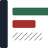

# The mark

*A ledger with three states where everything else has two.*



---

## Why it is not an AI logo

The obvious brief for a tool in this category is a neural mesh, a gradient, a
hexagon, a glowing node. That was considered and rejected, because **looking
like the category you are arguing with is a positioning mistake.**

stagecheck's claim is that it is *not* another eval framework — it is
accounting. It asks whether a layer earns its cost, not whether an answer is
good. A mark that reads as AI tooling would say the opposite of the README.

So the mark is drawn from what the tool actually is: a **ledger**. Ruled,
counted, auditable, and unglamorous on purpose.

## What it shows

A bound edge with three rows hanging off it.

| | |
|---|---|
| the spine | the ledger itself — a bound edge, not a chart axis |
| green row | records the stage **judged** and passed |
| red row | records it **judged** and failed |
| hatched row | records it **could not judge** |

That third row is the entire product. Every other tool in this space has two
states; the hatch is the one nobody models, and it is deliberately the only row
without a colour — an absence of measurement should not render as a
measurement.

## Why a spine and not three floating rows

Three bars alone read as a **bar chart**, and a chart is a picture of data
rather than an identity. The spine turns them into one object — something bound,
something you could pick up. It also anchors the composition at small sizes: at
16px the rows would otherwise scatter.

Earlier candidates, and why they lost: a tri-state checkbox (legible, but three
small objects rather than one mark), a tally with a strike (warm, but the
tally-strike is a common visual), a stamp (the metaphor is exact, but circles
crowd a wordmark and it loses detail fastest), a fraction bar (the truest idea,
the least immediate mark).

## The hatch, and the one place it is replaced

Diagonal hatching reads as noise below about 20px. Under that, the third row
becomes **flat grey at 45–50% opacity**.

That substitution is declared rather than quietly done, because it is the same
rule the tool applies to itself: the row still says *counted, not judged*, and
losing the texture does not lose the meaning. `generate.py` takes `flat=True`
for exactly this.

## Light and dark

Every file carries a `prefers-color-scheme` media query, so one asset adapts
rather than needing two kept in step.

The first version did not, and the failure was one-sided in an instructive way:
the **mark** survived on a dark README because its rows carry their own colour,
and the **wordmark disappeared entirely** — ink `#1A2332` on `#0D1117`. A mark
whose meaning is carried by colour degrades gracefully; type does not.

The colours do not simply invert. On dark the greens and reds **lift** —
`#2F6B4F` is legible on paper and muddy on ink — and the hatch moves to a grey
that reads against a dark ground instead of vanishing into it.

**The limitation, stated:** `prefers-color-scheme` follows the reader's
browser or OS setting, not the surrounding background. GitHub and GitLab both
follow that same preference by default, so this lands correctly for nearly
everyone; someone forcing a dark site theme against a light OS would still see
dark on dark. The alternative — a `<picture>` element with two files — is
supported on GitHub, inconsistent on GitLab, and means two assets to keep in
step. One adaptive file was the better trade.

## Palette

| | | |
|---|---|---|
| ink | `#1A2332` | blue-black, the spine and all type |
| judged | `#2F6B4F` | passed |
| failed | `#A4322B` | ledger red, the traditional colour for what is wrong |
| cannot judge | `#9A958C` | grey, never a colour |
| paper | `#FBFAF7` | warm near-white, not cream |

On dark: ink becomes `#E6E9ED`, judged `#5FBF88`, failed `#E27A72`, and the
hatch `#7E8895`.


## Motion

The mark animates, and the animation is an argument rather than an effect.

**`mark-loop.svg` — the default.** Six seconds. The rows tally in **discrete
steps**, never eased: a ledger is counted one record at a time, and smooth
easing would make it a progress bar. It then **holds still for three seconds**
before clearing. The long hold is what makes a loop bearable — for most of the
cycle it is simply the logo.

**`mark-once.svg`** plays that once and stops. Use it anywhere the reader is
meant to read past it — which is why the README header uses `lockup-once.svg`
rather than the looping variant. A mark that keeps moving above text somebody is
about to read is an irritant, and **a lockup that only works when it moves is not
a lockup**: the static file is the fallback and it must stand alone.

**`mark-breath.svg`** is the quietest loop: nothing changes shape, only the
unjudged row's opacity. A loop that changes shape draws the eye every cycle; one
that changes only opacity does not.

Not shipped, and worth knowing why they were built and dropped: a *scan* (a rule
travelling down the page), a *drain* (the third row emptying), an *uncertain*
(the third row's width never settling twice), and a *spinner*. The last is a
loading state and belongs nowhere near an identity.

## Files

| file | use |
|---|---|
| `mark.svg` | the mark, light background |
| `mark-loop.svg` | **README header, hero** — counts, holds, clears |
| `mark-once.svg` | docs, slides — plays once |
| `mark-breath.svg` | permanent placements — opacity only |
| `tile.svg` | avatar, social, app icon |
| `lockup-once.svg` | **README header** — counts on load, then stops |
| `lockup.svg` | mark + wordmark, static — the fallback |
| `lockup-loop.svg` | mark + wordmark, looping — landing pages |
| `lockup-tagline.svg` | mark + wordmark + tagline |
| `lockup-loop-tagline.svg` | the same, looping |
| `lockup-large.svg` | 72px hero |
| `favicon-16/32/64.svg` | 16 is flat-grey by design |
| `generate.py` | **produces every file above from one geometry** |

## Regenerating

Nothing here is hand-drawn. One geometry, one script:

```bash
python3 assets/generate.py
```

Spine at 16% of the mark's width; three rows at 16% height with 10% gaps,
starting at 26%; widths 78 / 48 / 62. Change a number there and every size,
lockup and favicon moves together — which is the only way a set like this stays
consistent once somebody is in a hurry.
